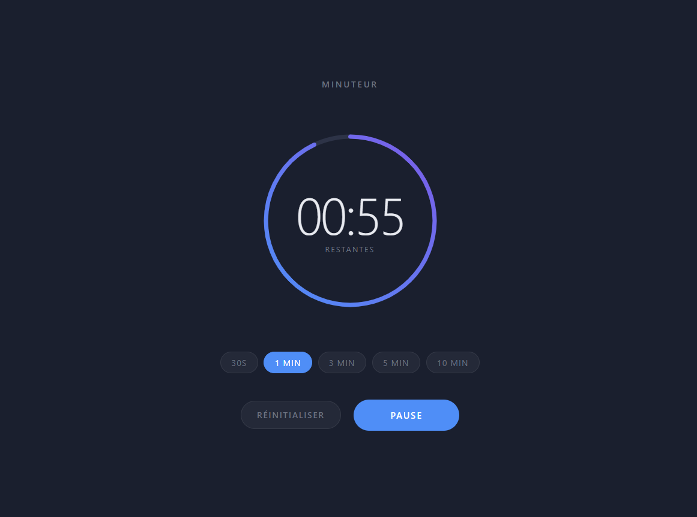

<div align="center">

# Minuteur

Minuteur interactif avec progression circulaire animée, affichage temps réel
et contrôles play / pause / réinitialiser. Durées personnalisables de 30 s à 10 min.


<br/>



</div>

---

## Fonctionnalités

- Progression circulaire animée avec dégradé bleu / violet
- Affichage du temps restant en temps réel (mm:ss)
- Contrôles **Démarrer / Pause / Reprendre / Réinitialiser**
- Sélection rapide de durée : **30s · 1 min · 3 min · 5 min · 10 min**
- Indicateur visuel à la fin du décompte
- Design sombre responsive, sans dépendance externe

---

## Utilisation

Ouvre `Minuteur/index.html` directement dans un navigateur — aucune installation requise.

---

## Structure

```
Minuteur/
├── index.html   # Structure HTML
├── style.css    # Thème sombre, cercle SVG, boutons
└── script.js    # Logique du minuteur
```
